# 🍽️ Zomato Business Insights

> A comprehensive Exploratory Data Analysis (EDA) project on the Zomato Restaurant Dataset using Python, featuring data cleaning, visualization, feature engineering, and actionable business insights.

---

# 📌 Project Overview

**Zomato Business Insights** is an Exploratory Data Analysis (EDA) project that analyzes restaurant data from the Zomato platform. The project focuses on understanding restaurant performance, customer preferences, pricing trends, online ordering services, and location-based patterns.

The analysis includes:

- Data Cleaning
- Missing Value Analysis
- Outlier Detection
- Univariate Analysis
- Bivariate Analysis
- Correlation Analysis
- Feature Engineering
- Business Insights & Recommendations

The project demonstrates the complete EDA workflow using Python and popular data analysis libraries.

---

# 🎯 Project Objectives

The objectives of this project are to:

- Understand the structure of the Zomato dataset
- Clean and preprocess the data
- Handle missing values and duplicate records
- Detect and treat outliers
- Perform Exploratory Data Analysis (EDA)
- Analyze restaurant ratings and customer engagement
- Study pricing trends and restaurant locations
- Discover relationships among numerical features
- Create meaningful business features
- Generate actionable business insights and recommendations

---

# 📂 Dataset

The dataset contains information about restaurants listed on Zomato, including:

- Restaurant Name
- Online Order
- Book Table
- Restaurant Type
- Location
- Cuisines
- Number of Votes
- Restaurant Rating
- Approximate Cost for Two
- Dish Liked
- Reviews List
- Menu Items

---

# 🛠️ Technologies Used

- Python
- Pandas
- NumPy
- Matplotlib
- Seaborn
- Jupyter Notebook
- VS Code
- Git
- GitHub

---

# 📁 Project Structure

```text
Zomato-Business-Insights/
│
├── data/
│   └── zomato.csv
│
├── notebook/
│   └── Zomato_EDA.ipynb
│
├── images/
│   ├── missing_values_by_column.png
│   ├── boxplots_outlier_detection.png
│   ├── boxplots_after_outlier_removal.png
│   ├── rating_distribution.png
│   ├── votes_distribution.png
│   ├── cost_for_two_distribution.png
│   ├── online_order_availability.png
│   ├── top_10_locations.png
│   ├── top_10_restaurant_types.png
│   ├── correlation_heatmap.png
│   ├── cost_for_two_vs_rating.png
│   └── average_rating_by_location_top15.png
│
├── reports/
│   └── Business_Brief.pdf
│
├── README.md
├── Business_Brief.md
├── requirements.txt
├── .gitignore
└── .gitattributes
```

---

# 📋 Project Workflow

1. Import Required Libraries
2. Load Dataset
3. Dataset Overview
4. Data Cleaning
5. Missing Value Analysis
6. Duplicate Removal
7. Outlier Detection
8. Univariate Analysis
9. Bivariate Analysis
10. Correlation Analysis
11. Feature Engineering
12. Business Insights
13. Conclusion

---

# 📚 Libraries Used

```python
import pandas as pd
import numpy as np
import matplotlib.pyplot as plt
import seaborn as sns
```

---

# 🧹 Data Cleaning

The following preprocessing steps were performed:

- ✔ Missing values handled
- ✔ Duplicate records removed
- ✔ Data types corrected
- ✔ Outliers detected using Boxplots
- ✔ Outliers treated using the IQR Method

---

# 📈 Exploratory Data Analysis

### Univariate Analysis

- Distribution of Restaurant Ratings
- Distribution of Customer Votes
- Distribution of Cost for Two
- Online Order Availability
- Top 10 Restaurant Locations
- Top 10 Restaurant Types

### Bivariate Analysis

- Cost for Two vs Restaurant Rating
- Average Rating by Location

### Correlation Analysis

- Correlation Heatmap of Numerical Features

---

# ⚙️ Feature Engineering

The following meaningful features were created:

- Cost Per Person
- Popular Restaurant Indicator
- High Rated Restaurant Category
- Restaurant Category based on Rating

---

# 📊 Project Visualizations

## Missing Values Analysis

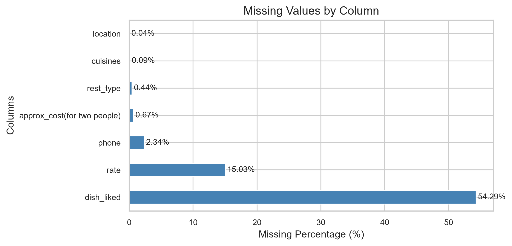

---

## Outlier Detection (Before Treatment)

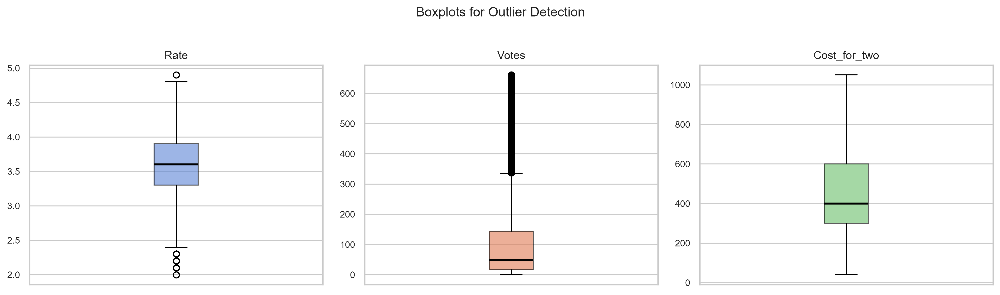

---

## Outlier Detection (After Treatment)

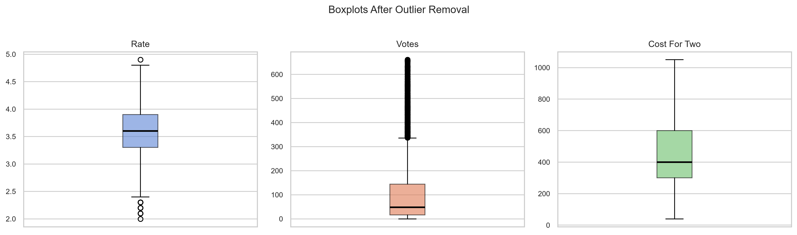

---

## Distribution of Restaurant Ratings

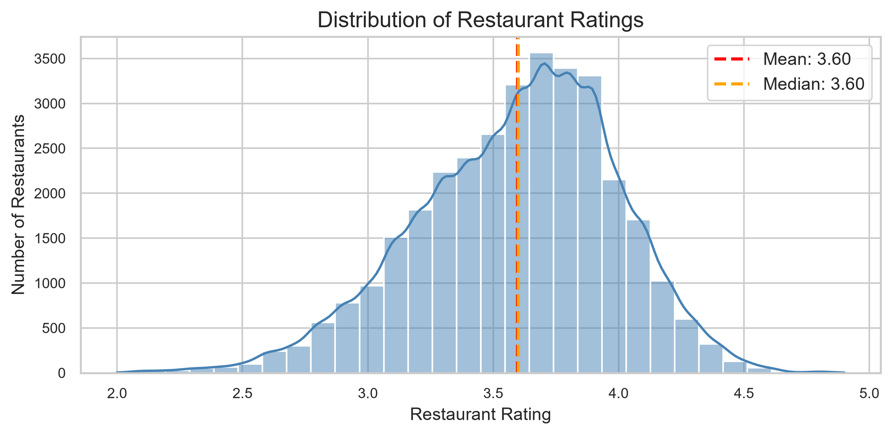

---

## Distribution of Customer Votes

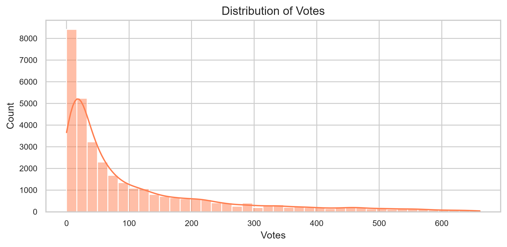

---

## Distribution of Cost for Two

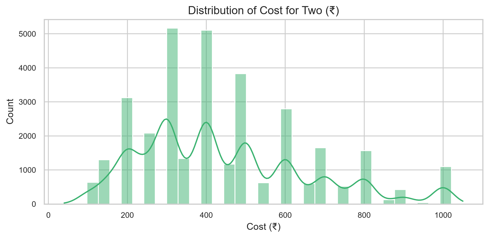

---

## Online Order Availability

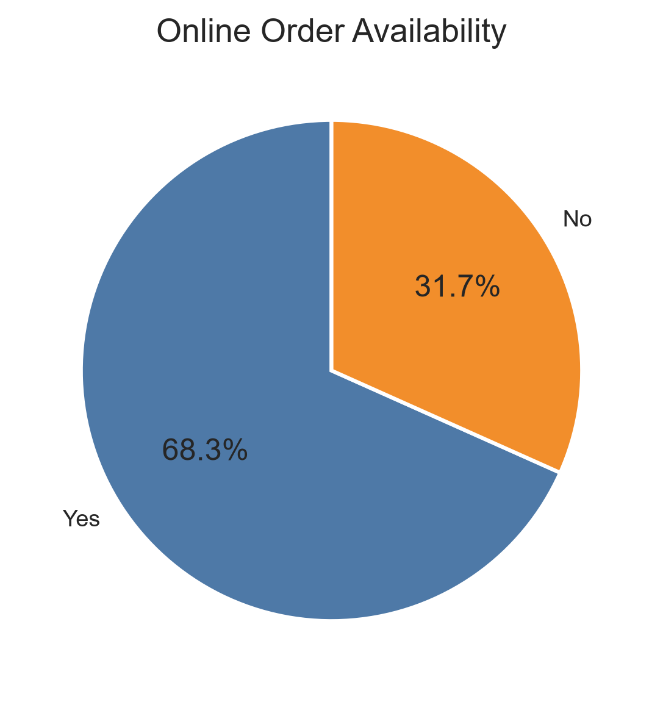

---

## Top 10 Restaurant Locations

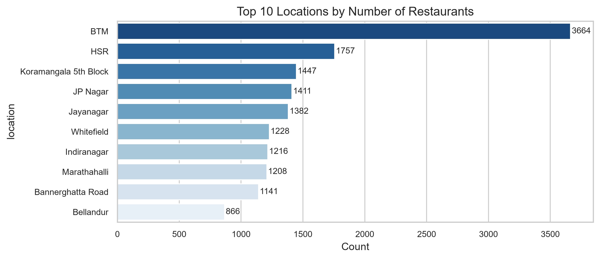

---

## Top 10 Restaurant Types

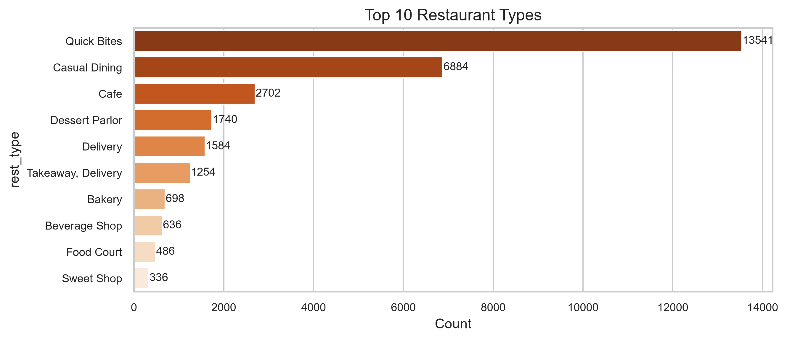

---

## Correlation Heatmap

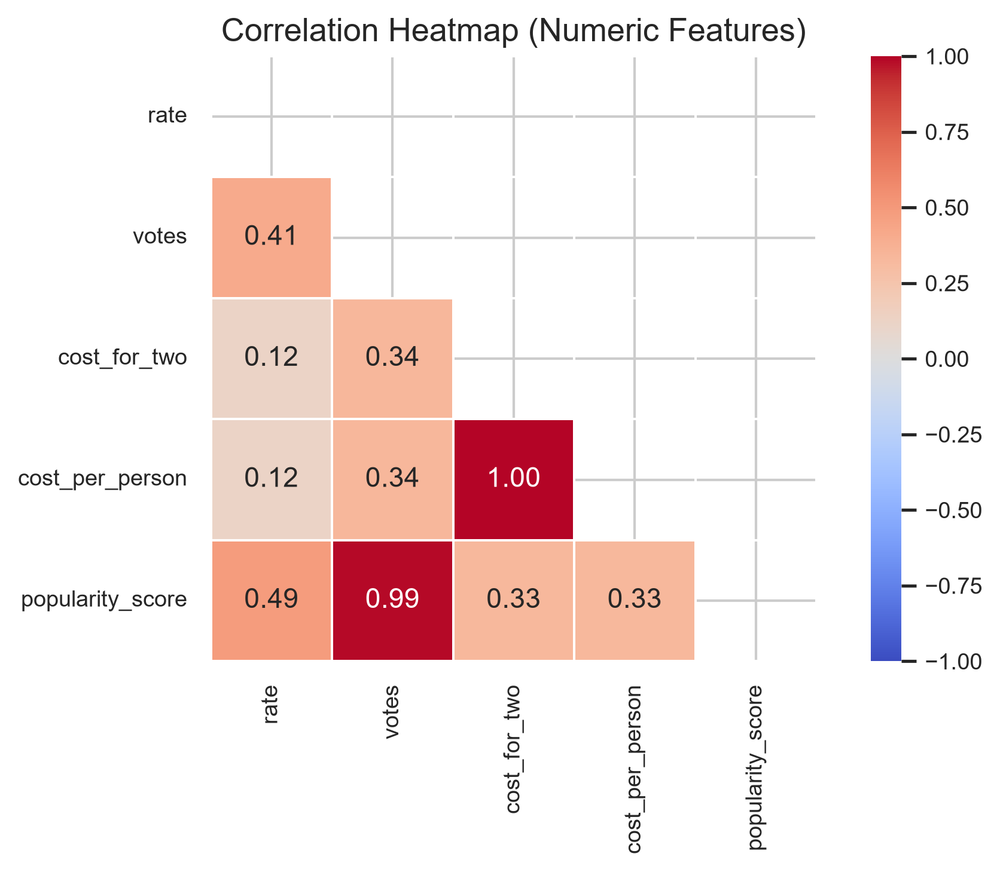

---

## Cost for Two vs Restaurant Rating

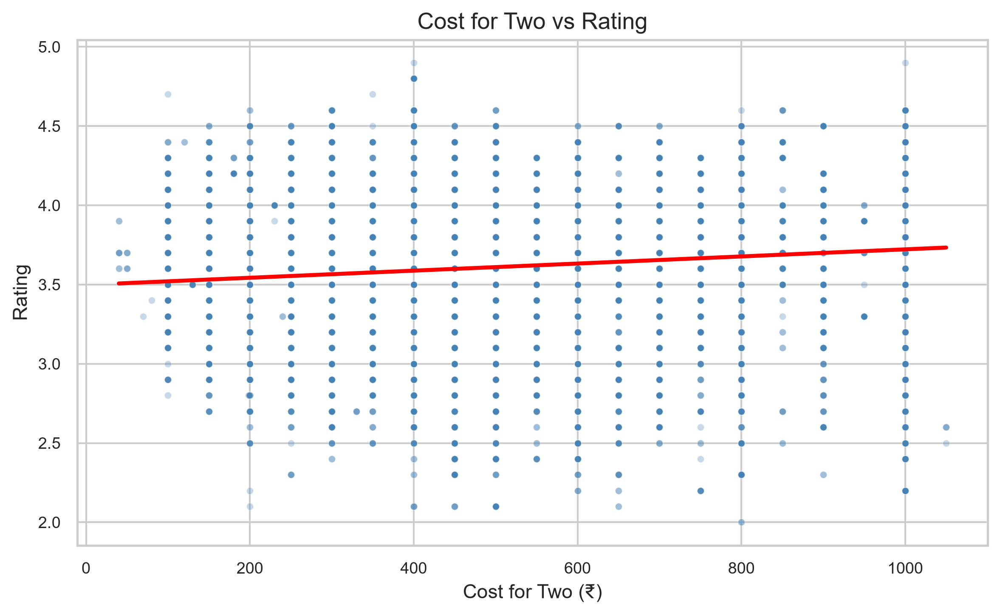

---

## Average Rating by Location

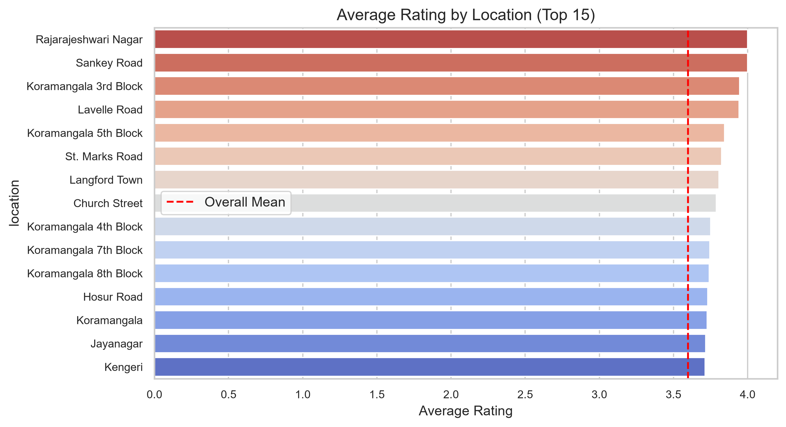

---

# 💡 Business Insights

- Restaurants with higher customer votes generally receive better ratings.
- Online ordering is available in a large proportion of restaurants, indicating strong customer demand.
- Popular restaurant locations contain significantly more restaurants than other areas.
- Most restaurants fall within the mid-range pricing category.
- Restaurant ratings are concentrated around higher values, reflecting generally positive customer satisfaction.
- Restaurant type influences customer popularity and engagement.
- Cost for two people has only a weak relationship with restaurant ratings.
- Outlier treatment improved the reliability of statistical analysis.
- Restaurant performance varies across different locations.
- Data-driven analysis helps identify customer preferences and business opportunities.

---

# 📈 Recommendations

- Improve food quality to increase customer ratings.
- Expand online ordering services.
- Focus marketing campaigns on high-demand locations.
- Encourage customers to leave reviews and ratings.
- Maintain competitive pricing based on customer preferences.
- Monitor restaurant performance using customer feedback.
- Invest in popular restaurant categories with higher engagement.
- Use data-driven insights to support future business decisions.

---

# ✅ Conclusion

The **Zomato Business Insights** project demonstrates how Exploratory Data Analysis (EDA) transforms raw restaurant data into meaningful business intelligence.

The analysis provides valuable insights into customer behavior, restaurant performance, pricing strategies, and location-based trends. These findings can help restaurant owners improve customer satisfaction, optimize pricing strategies, and make informed business decisions.

---

# 📄 Business Report

A one-page summary of the project is available in the **reports** folder.

```text
reports/
└── Business_Brief.pdf
```

---

# 🚀 Skills Demonstrated

- Python Programming
- Data Cleaning
- Data Preprocessing
- Exploratory Data Analysis (EDA)
- Feature Engineering
- Data Visualization
- Statistical Analysis
- Business Analytics
- Git & GitHub
- Problem Solving

---

# ⚙️ Installation

Clone the repository:

```bash
git clone https://github.com/your-username/Zomato-Business-Insights.git
```

Install the required libraries:

```bash
pip install -r requirements.txt
```

Run the Jupyter Notebook:

```bash
jupyter notebook
```

Open:

```text
notebook/Zomato_EDA.ipynb
```

---

# 📜 License

This project is licensed under the **MIT License**.

See the **LICENSE** file for more information.

---

## ⭐ If you found this project useful, consider giving it a Star on GitHub!